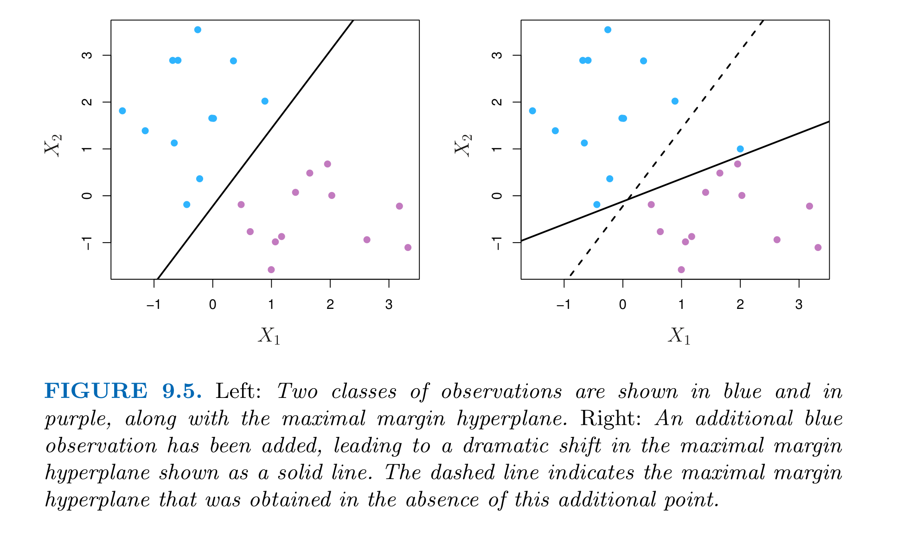



## Support Vector Classifier

The idea of SVM comes from solving the binary classification problem by separating the $p$ dimensional space using a $p-1$ dimensional hyperplane. If $p=2$, then the "hyperplane" will just be a line.

To make the boundary of classes less vulnerable to slight change of "support vectors" (which are observations close to the hyperplane that have direct impact on the hyperplane), we introduce the <u>support vector classifier</u> that allow some misclassifications (soft margin classifier). They will offer,

-   greater robustness of individual observations
-   better classifications for most training observations

The chart below shows that a maximal margin hyperplane always try to classify all the observations on the right side, and then maximize the margin. So it can be very volatile.

SVC introduces a parameter $C$ which allows some tolerance to violate the margin. The goal remains to be maximizing the margin with this new constraint. The formal problem step up is as follows


$$
\begin{aligned}
&\underset{\beta_{0}, \beta_{1}, \ldots, \beta_{p}, \epsilon_{1}, \ldots, \epsilon_{n}, M}{\operatorname{maximize}} M\\
&\text { subject to } \sum_{j=1}^{p} \beta_{j}^{2}=1 \text {, }\\
&y_{i}\left(\beta_{0}+\beta_{1} x_{i 1}+\beta_{2} x_{i 2}+\cdots+\beta_{p} x_{i p}\right) \geq M\left(1-\epsilon_{i}\right) \text {, }\\
&\epsilon_{i} \geq 0, \quad \sum_{i=1}^{n} \epsilon_{i} \leq C,
\end{aligned}
$$


When we classify a new observation, say $x^{\star}$, we look at the **sign** of $f\left(x^{\star}\right)=\beta_{0}+\beta_{1} x_{1}^{\star}+\cdots+\beta_{p} x_{p}^{\star}$, as only the side of the hyperplane is decisive in classifying.

### Summary